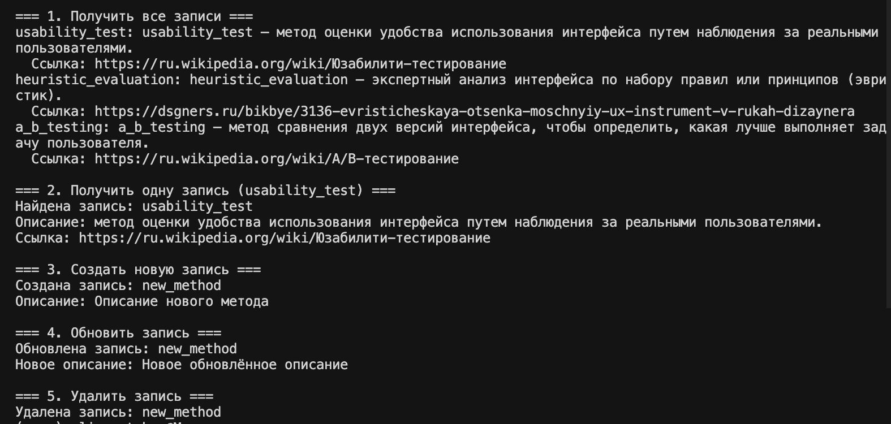

## RPC. gRPC. Protobuf

### Описание выполнения работы

1. Разработка gRPC приложения

Проект реализует сервис словаря терминов UX/UI дизайна с использованием gRPC и Protocol Buffers. Сервис предоставляет CRUD операции для управления терминами в словаре через gRPC API.

Основные компоненты:
- **Proto-файл** (`app/proto/glossary.proto`) - определение сервиса и сообщений
- **Сервер** (`app/src/server_main.py`) - реализация gRPC сервера
- **Клиент** (`app/src/client_main.py`) - клиент для тестирования сервиса
- **Словарь** (`app/src/glossary.py`) - исходные данные терминов

2. Структура файлов разработанного приложения

```
lab4/
├── app/
│   ├── generated/          # Сгенерированные файлы protobuf
│   │   ├── glossary_pb2.py
│   │   └── glossary_pb2_grpc.py
│   ├── proto/              # Определения protobuf
│   │   └── glossary.proto
│   └── src/
│       ├── glossary.py      # Исходные данные словаря
│       ├── models.py        # Модели данных
│       ├── server_main.py   # gRPC сервер
│       └── client_main.py   # gRPC клиент
├── tools/
│   └── build_proto.py      # Скрипт генерации protobuf файлов
├── requirements.txt        # Зависимости Python
├── run_server.py          # Скрипт запуска сервера
├── run_client.py          # Скрипт запуска клиента
└── README.md              # Документация
```

3. Инструкция по запуску приложения

3.1. Создание и активация виртуального окружения Python:

```bash
python -m venv venv
source venv/bin/activate 
```

3.2. Установка пакетов:

```bash
pip install -r requirements.txt
```

Устанавливаются следующие пакеты:
- `grpcio==1.56.0`
- `grpcio-tools==1.56.0`
- `protobuf==4.24.4`
- `pydantic>=2.0.0`

3.3. Генерация на основе protobuf-файлов:

```bash
python tools/build_proto.py
```

Эта команда создаст файлы `glossary_pb2.py` и `glossary_pb2_grpc.py` в директории `app/generated/`.

3.4. Запуск скрипта сервера:

```bash
python run_server.py
```

Или альтернативный способ:

```bash
python -m app.src.server_main
```

Сервер запустится на порту `50051` и будет слушать на `0.0.0.0:50051`.

Вы должны увидеть сообщение:
```
gRPC Glossary server listening at 0.0.0.0:50051
```

3.5. Запуск скрипта клиента (в отдельном терминале):

```bash
python run_client.py
```

Или альтернативный способ:

```bash
python -m app.src.client_main
```

Клиент выполнит серию тестовых операций:
- Получение всех записей из словаря
- Получение одной записи (usability_test)
- Создание новой записи
- Обновление записи
- Удаление записи

Пример вывода клиента:



### Исследовательская задача

1. От REST к gRPC и GraphQL: современный подход к API: https://habr.com/ru/articles/961000/
2. REST, GraphQL и gRPC: https://proglib.io/p/rest-graphql-i-grpc-gayd-dlya-nachinayushchih-razrabotchikov-2024-07-03
3. Разница между REST, GraphQL и gRPC: https://dev-gang.ru/article/raznica-mezhdu-rest-graphql-i-grpc-sd55zqf705/

### Краткое резюме:
gRPC лидирует в скорости (2-5x быстрее REST) и throughput для микросервисов. GraphQL гибче для клиентских запросов, но с оверхедом. REST проще, уступает на нагрузке.
